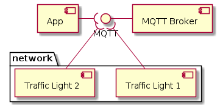

# IOT System

## Participants

```
Lorna Flerida Espinosa Cuello / 20145845
Dante Faña Badia / 20156079
```

## Document Purpose

This document has as purpose to define in big scale all project decision and components, also have the documentation of the project.

### Audience

- Professor and monitors: to evaluate and get feedbacks from them.
- Peers students: to share knowledge and ideas.

### Solution Overview

This project consists in a IoT solution that allow user to management traffic light using a cellphone.

#### Uses cases

- Init crosswalk from App Mobile
- Calculate user proximity base 
- Count steps
- Convert steps to meter 
- Present counter 

## Deliverable 1

### Goals

- Define the technology stack 
- Define the solution overview 
- Document the reason of the technology selection 

#### Components and Connector



### Technology Stack

Here is technology stack benchmark and selection.

<table>
  <thead>
    <tr>
      <th>Decision</th>
      <th>Alts</th>
      <th>Pros</th>
      <th>Cons</th>
    </tr>
  </thead>
  <tbody>
    <tr>
      <td>Programming language: python</td>
      <td>
        <ul>
          <li>Java</li>
          <li>C#</li>
          <li>JavaScript</li>
           <li>Node</li>
        </ul>
      </td>
      <td>
        <ul>
          <li>Developer knowledge</li>
          <li>Native support</li>
          <li>Simplicity</li>
          <li>Good library support</li>          
        </ul>
      </td>
      <td>
        <ul>
          <li>n/a</li>
        </ul>
      </td>
    </tr>
    <tr>
      <td>MQTT</td>
      <td>
        <ul>
          <li>RabbitMQ</li>
          <li>AWS Greengrass</li>
        </ul>
      </td>
      <td>
        <ul>
          <li>Simplicity</li>
          <li>IoT support</li>
        </ul>
      </td>
      <td>
        <ul>
          <li>This is more recommend implementing IoT solution</li>
        </ul>
      </td>
    </tr> 
    <tr>
      <td>Javascript</td>
      <td>
        <ul>
          <li>Java</li>
          <liade>iOS</li>
        </ul>
      </td>
      <td>
        <ul>
          <li>Simplicity</li>
          <li>Support MQTT</li>
        </ul>
      </td>
      <td>
        <ul>
          <li>Simplification to implement</li>
        </ul>
      </td>
    </tr>
  </tbody>
</table>
